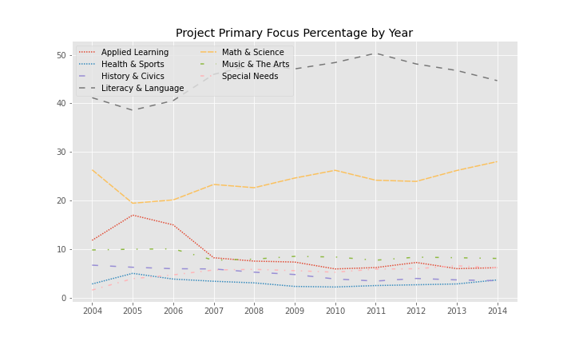
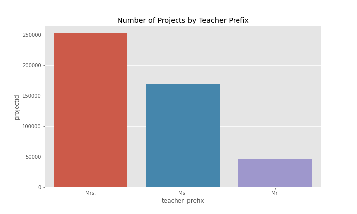
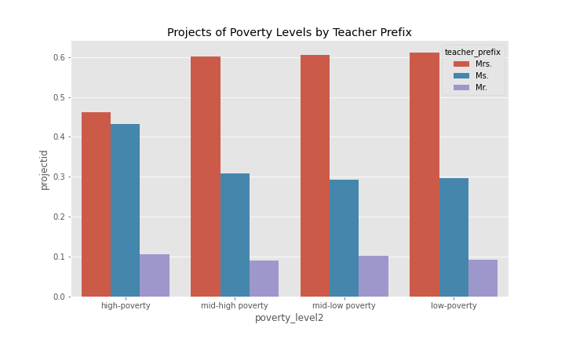

<!--
*** This document is a thorough visualization of the donorschoose and stanford education data sets
-->

<!-- ABOUT THE PROJECT -->
# DonorsChoose Dataset

## School Distributuion

## Project Description
### Variation by Year

### Variation by Teacher Prefix

