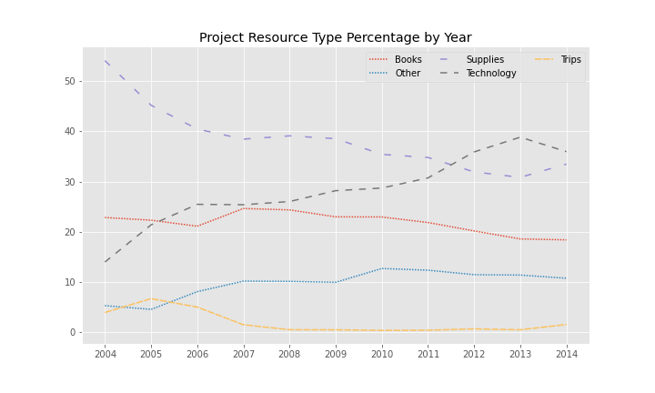
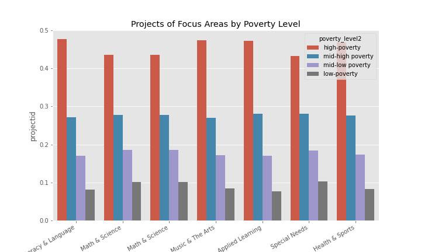
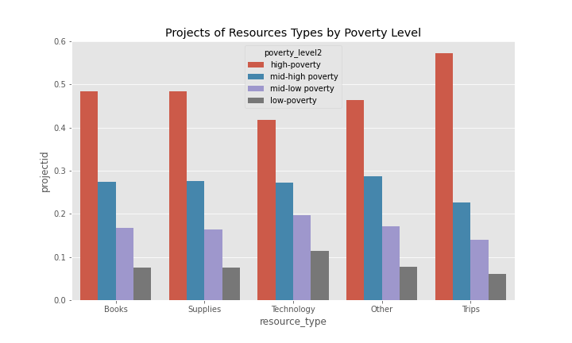
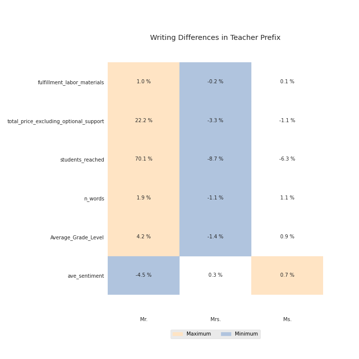

<!--
*** This document is a thorough visualization of the donorschoose and stanford education data sets
-->

<!-- ABOUT THE PROJECT -->
# DonorsChoose Dataset

## School Distributuion

## Project Description
### Variation by Year

### Variation by Teacher Prefix

### Variation by Poverty Level

### Variation in Writing

### Variation in Stanford Education Data
School Covariates
* totenrl	total enrollment (CCD) (2009-18 weighted average)	
* perwht	proportion white (CCD) (2009-18 weighted average)	
* perfrl	proportion free or reduced lunch eligible (CCD) (2009-18 weighted average)	
* perecd	proportion economically disadvantaged (Ed Facts) (2009-18 weighted average)	
* gifted_tot	proportion classified as gifted (CRDC) (2012, 2014, 2016, 2018 weighted average)	
* disab_tot	proportion classified as disabled (CRDC) (2012, 2014, 2016, 2018 weighted average)	
* lep	proportion limited english proficient (CRDC) (2012, 2014, 2016, 2018 weighted average)	

Academic Achievements
* cs_mn_avg_ol	School Mean Ach, Math&RLA
* cs_mn_coh_ol	School Cohort Slope of Mean Ach, Math&RLA
* cs_mn_grd_ol	School Grade Slope of Mean Ach, Math&RLA
* cs_mn_mth_ol	School Math-RLA Diff in Mean 

