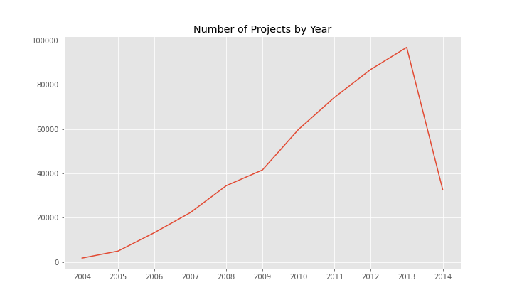
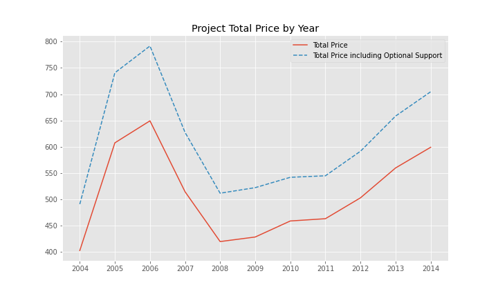
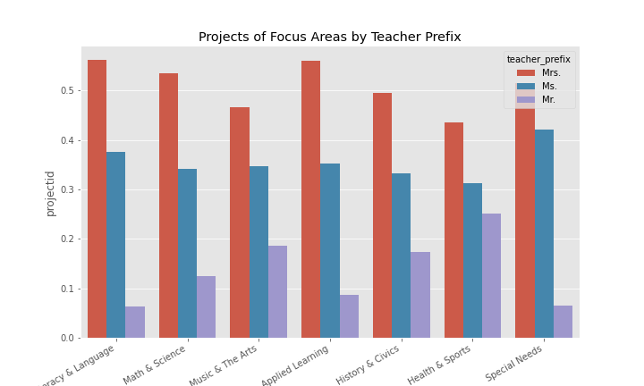
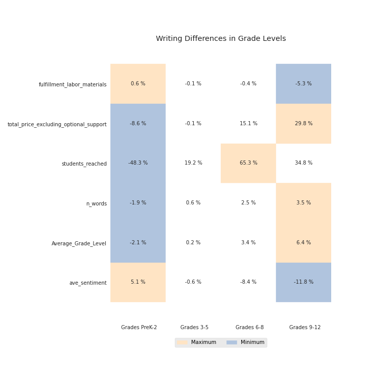
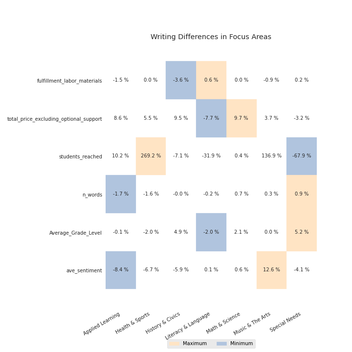
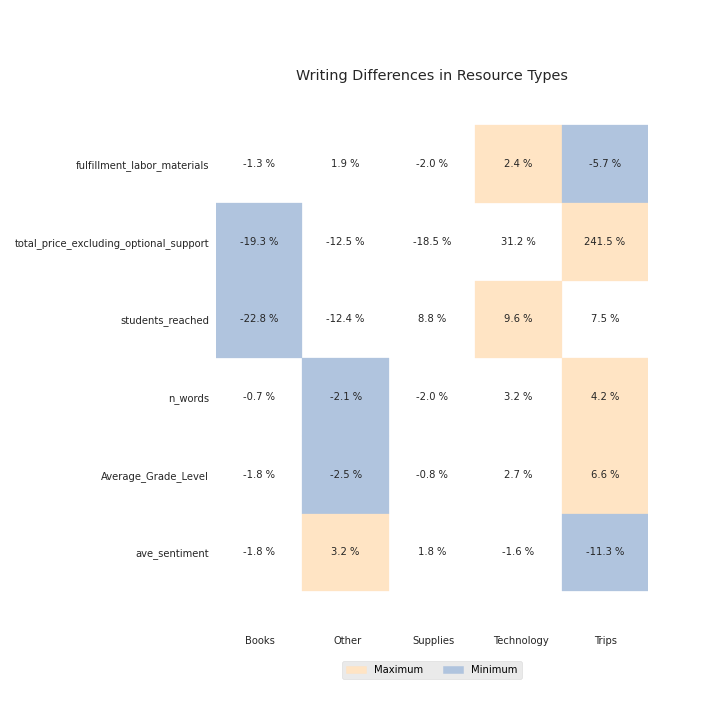
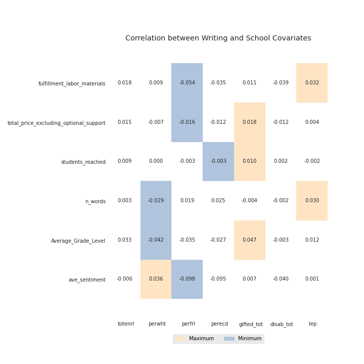
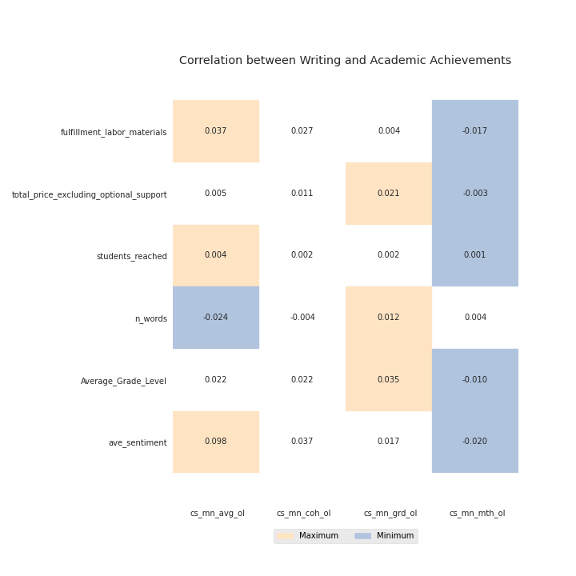

<!--
*** This document is a thorough visualization of the donorschoose and stanford education data sets
-->

<!-- ABOUT THE PROJECT -->
# DonorsChoose Dataset

## School Distributuion

## Project Description
### Variation by Year

### Variation by Teacher Prefix

### Variation in Writing

### Variation in Stanford Education Data
School Covariates
* sch_sped	special education school indicator flag (CRDC) (2018)	
* totenrl	total enrollment (CCD) (2009-18 weighted average)	
* perwht	proportion white (CCD) (2009-18 weighted average)	
* pernam	proportion native american (CCD) (2009-18 weighted average)	
* perasn	proportion asian (CCD) (2009-18 weighted average)	
* perhsp	proportion hispanic (CCD) (2009-18 weighted average)	
* perblk	proportion black (CCD) (2009-18 weighted average)	
* perfl	proportion free lunch eligible (CCD) (2009-18 weighted average)	
* perrl	proportion reduced lunch eligible (CCD) (2009-18 weighted average)	
* perfrl	proportion free or reduced lunch eligible (CCD) (2009-18 weighted average)	
* perecd	proportion economically disadvantaged (Ed Facts) (2009-18 weighted average)	
* gifted_tot	proportion classified as gifted (CRDC) (2012, 2014, 2016, 2018 weighted average)	
* disab_tot	proportion classified as disabled (CRDC) (2012, 2014, 2016, 2018 weighted average)	
* disab_tot_id	proportion classified as disabled (IDEA Only) (CRDC) (2012, 2014, 2016, 2018 weighted average)	
* lep	proportion limited english proficient (CRDC) (2012, 2014, 2016, 2018 weighted average)	
* gifted_flag	school has 40%+ gifted students	
* lep_flag	school has 50%+ LEP students	
* sped_flag	school has 40%+ special education students or is listed as a special education school in CCD or CRDC	
* spedidea_fla	school has 40%+ sped students (IDEA only) OR is listed as sped school in CCD or CRDC	
* avgrdall	average per grade enrollment (CCD) (2009-18 weighted average)

Academic Achievements
* gradecenter	Grade used for pooled centering	
* gap	Gap Estimate Indicator	
* tot_asmts	Total number of math + RLA tests for pooled estimates	
* cellcount	Total number of math + RLA cells for pooled estimates	
* mn_asmts	Per grade number of math + RLA cells for pooled estimates (tot_asmts/cellcount)	
* cs_mn_avg_ol	School Mean Ach, Math&RLA, OLS est, CS		School Mean SEDA EDFacts Test-Based Achievement  Math&RLA, Ordinary Least Squares (OLS) estimate,  Cohort Scale (CS)	* 
* cs_mn_coh_ol	School Cohort Slope of Mean Ach, Math&RLA, OLS est, CS		School Cohort Slope of Mean SEDA EDFacts Test-Based Achievement  Math&RLA, Ordinary Least Squares (OLS) estimate,  Cohort Scale (CS)	
* cs_mn_grd_ol	School Grade Slope of Mean Ach, Math&RLA, OLS est, CS		School Grade Slope of Mean SEDA EDFacts Test-Based Achievement  Math&RLA, Ordinary Least Squares (OLS) estimate,  Cohort Scale (CS)	
* cs_mn_mth_ol	School Math-RLA Diff in Mean Ach, Math&RLA, OLS est, CS		School Math-RLA Diff in Mean SEDA EDFacts Test-Based Achievement  Math&RLA, Ordinary Least Squares (OLS) estimate,  Cohort Scale (CS)	
* cs_mn_avg_eb	School Mean Ach, Math&RLA, EB est, CS		School Mean SEDA EDFacts Test-Based Achievement  Math&RLA, Empirical Bayes (EB) estimate,  Cohort Scale (CS)	
* cs_mn_coh_eb	School Cohort Slope of Mean Ach, Math&RLA, EB est, CS		School Cohort Slope of Mean SEDA EDFacts Test-Based Achievement  Math&RLA, Empirical Bayes (EB) estimate,  Cohort Scale (CS)	
* cs_mn_grd_eb	School Grade Slope of Mean Ach, Math&RLA, EB est, CS		School Grade Slope of Mean SEDA EDFacts Test-Based Achievement  Math&RLA, Empirical Bayes (EB) estimate,  Cohort Scale (CS)	
* cs_mn_mth_eb	School Math-RLA Diff in Mean Ach, Math&RLA, EB est, CS		School Math-RLA Diff in Mean SEDA EDFacts Test-Based Achievement  Math&RLA, Empirical Bayes (EB) estimate,  Cohort Scale (CS)H40	

