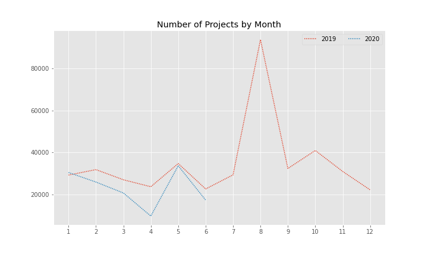
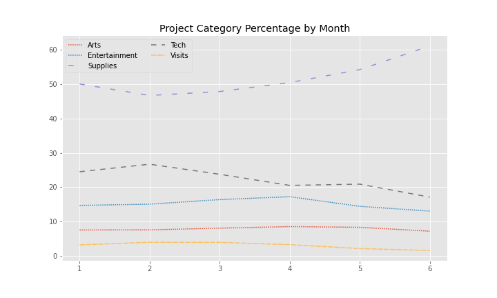
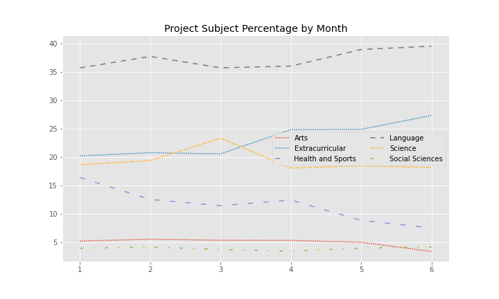
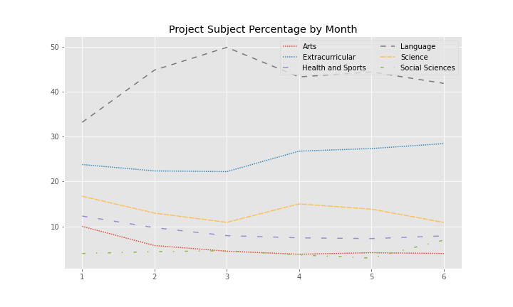
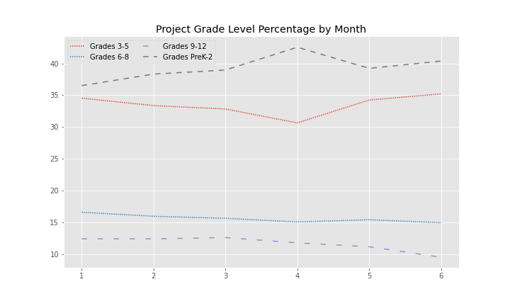
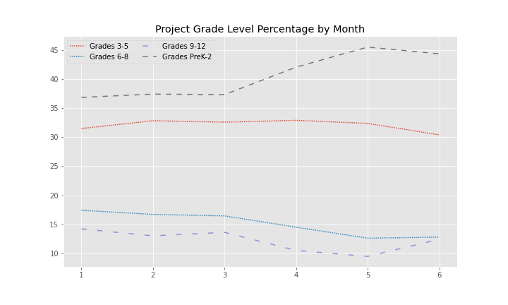
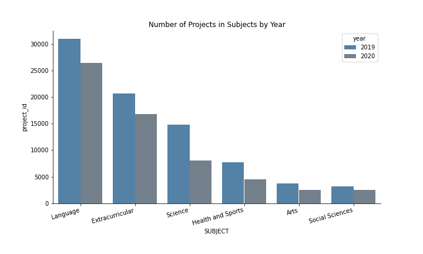
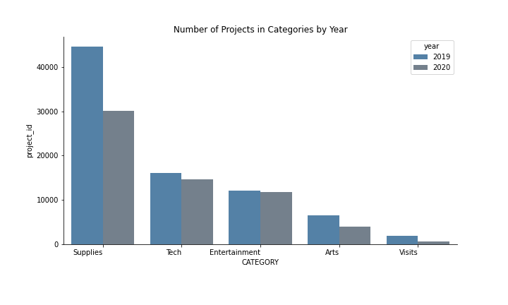
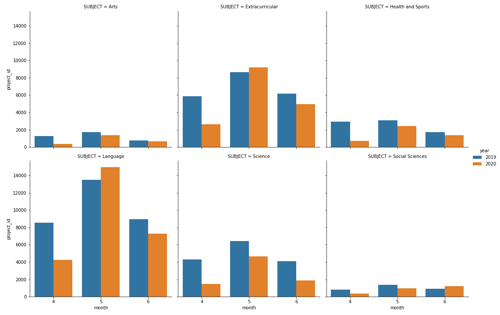
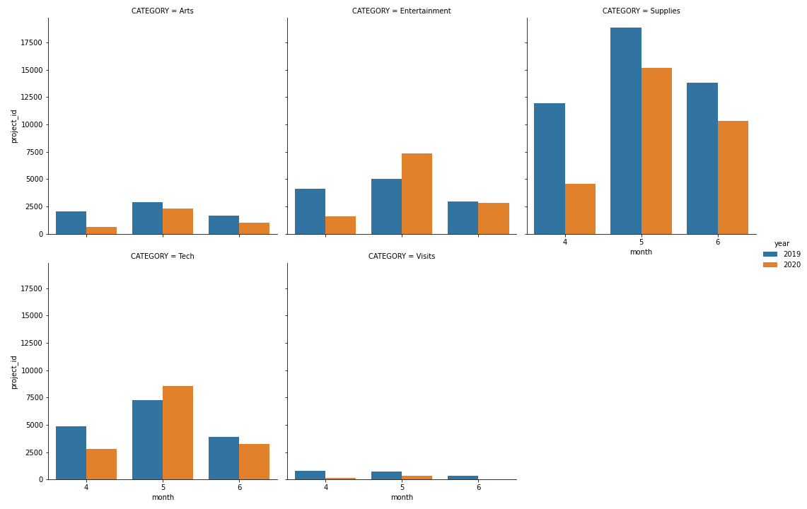

## 2019 and 2020 crowdfunding essays

### category
'Arts': 'Art Supplies', 'Musical Instruments'

'Supplies': 'Supplies','Books', 'Lab Equipment','Classroom Basics', 'Awaiting Classification','Reading Nooks, Desks & Storage','Flexible Seating','Food, Clothing & Hygiene','Other'

'Tech': 'Technology','Computers & Tablets','Instructional Technology'

'Entertainment': 'Sports & Exercise Equipment','Educational Kits & Games'

'Visits': 'Virtual Trips','Virtual Visitors'

### subject_category
'Science': 'Applied Sciences','Environmental Science','Mathematics','Health & Life Science'

'Language': 'Financial Literacy','Literacy','Literature & Writing','Foreign Languages','ESL'

'Social Sciences': 'History & Geography','Social Sciences', 'Economics', 'Civics & Government'

'Health and Sports': 'Health & Wellness', 'Nutrition Education','Special Needs','Gym & Fitness','Team Sports'

'Arts': 'Visual Arts','Music','Performing Arts'

'Extracurricular': 'Parent Involvement', 'Extracurricular','Community Service','Warmth, Care & Hunger','Character Education','Early Development','College & Career Prep','Social Emotional Learning','Other'

### grade_level
"Grades PreK-2","Grades 3-5","Grades 6-8","Grades 9-12"

### Subject and Category

### Poverty Level
`Test Loss: 0.508 | Test Acc: 75.02%`

Rich

['school\u200b', 'flipgrid', 'sharpers', 'windowless', 'slinkies', '2020/2021', 'playdoh', 'gineers', 'headset', 'duct', 'that-', '-on', 'eight-', 'year-', 'squishies', 'reteaching', '\u200band', 'splitter', 'la', 'para', 'gon', 'mindedness', 'alouds', 'throwable', 'zippered', 'crate', 'engross', 'porch', 'on\u200b', 'departmentalized', 'clicks', 'scanned', 'students-', 'robotic', 'algebraic', 'bead', 'pincer', 'pains', 'chord', 'freshman', 'configured', 'boundless', 'folder', 'audiobooks', 'pouch', 'bookshelf', 'w', 'lockers', 'starter', 'thermochemistry', 'rectangular', 'powers', 'weekday', 'violin', 'seating', 'divider', 'dimensional', 'court', 'covid-19', 'coat', 'browsing', 'adapter', 'progressions', 'infinite', 'chargers', 'cartridge', 'rechargeable', 'awe', 'twelfth', 'percentile', 'flight', 'potting', 'upload', 'i3', 'surf', 'simulators', 'covid', 'vessel', 'is\u200b', 'refills', '=', 'quests', 'twistable', 'debug', 'fantasy', 'energize', 'paddles', '8th', 'drone', 'fluorescent', 'scanning', 'corona', 'bookcases', 'sequel', 'clarinets', 'ebooks', 'repetitive', 'align', 'division', 'kinders']

Poor

['individualities', 'benefits', 'textured', 'epidemic', 'kidney', '1000x', 'prevention', 'neighborhoods', 'incomes', 'surveyed', 'disability', 'supplemental', 'soar', 'average', 'urban', 'severe', 'rate', 'chip', 'migrant', 'breakfast', 'market', 'poorest', 'worst', '10-year', 'rising', 'low', 'adoptions', 'demographic', 'cash', 'poor', 'populations', 'rural', 'reap', '2nd-5th', 'illiterate', 'unproductive', 'inequality', 'decrease', 'impoverished', 'living', 'fourths', 'pandemic', 'families', 'possible-', 'affluent', 'net', 'heating', 'welfare', 'fund', 'households', 'laminator', 'bilingualism', 'kinesthetically', 'dollars', 'booming', 'percent', 'existent', 'disadvantaged', '1.9', 'electricity', 'socioeconomic', 'hotels', 'expenses', 'osmos', 'suffering', 'allotment', 'harvest', '%', 'burden', 'iready', 'tuition', 'underprivileged', 'deficit', 'disease', 'monsoon', 'borrowing', 'hyperactivity', 'someday\u200b', '65', 'productivity', 'savings', 'learnings', '1.5', 'consumption', 'cereal', 'chocolate', 'low‑income', 'outbreak', 'boroughs', 'exceeding', 'poverty', 'alleviate', 'cheese', 'income', 'burdened', '$', 'village', 'nt', 'employment', 'million']

### Covid19

`Test Loss: 0.547 | Test Acc: 75.88%`

2019

['powerpoints', '200-hour', 'kinesthetically', 'protractors', 'that-', 'qr', 'income\u200b', 'keychains', 'chord', 'harmonies', 'manifold', 'overlapping', 'alouds', 'metallophones', 'modal', 'playdough', 'aquarium', 'world\u200b', 'scavenger', 'repertoire', 'orbit', 'multimodal', 'touchscreen', 'students-', 'hyperdocs', 'working\u200b', 'rectangular', 'bookcase', 'smartboard', 'weave', 'movable', 'lifecycle', 'progressions', '504s', 'decimal', 'temperature', 'classroom-', 'boo', 'stringed', '1000x', 'inclusiveness', 'seating', 'selfie', 'curved', 'auditorium', 'hunts', 'cohesive', 'slime', 'configured', 'zipper', 'melodies', 'on\u200b', 'zippered', 'florescent', 'thematic', '3d', 'fist', 'hands-', '\u200band', 'teaser', 'wasn', 'iready', 'coughing', 'makerspace', 'hoop', 'sneakers', 'rays', 'efficacy', 'fictional', 'saucer', 'modular', 'freshly', 'blacktop', 'laminate', 'counters', 'pale', 'weighted', 'nonfiction', 'writings', 'interface', 'courtyard', 'cage', 'downloaded', 'customizable', 'extracurricular', 'sunglasses', 'philosophy', 'sketches', 'nationalities', 'circular', 'confines', 'loveable', 'poems', 'purifier', 'foldable', 'ensembles', 'productively', 'percentile', 'bracelets', 'assemblies']

2020

['wealth', 'preforming', 'metro', 'dose', 'rates', 'productivity', 'region', 'affected', 'breakfast', 'lodging', 'deficit', '85', 'dollar', 'exposure', 'camps', 'beacon', 'village', 'plentiful', 'households', 'homelessness', 'sustenance', 'weak', '6-', 'counties', '49', 'burden', 'rate', 'handouts', 'seizures', 'spread', 'stricken', 'reduction', 'lexia', 'reminder', 'instability', 'loan', 'racially', 'hardships', 'qualifies', 'pizza', 'alleviate', 'flood', 'infectious', 'blankets', 'rural', 'lagging', 'endured', 'shortage', 'low', 'refugee', 'survivors', 'upkeep', 'expend', 'socio', 'tuition', 'reliant', 'reunite', '®', 'prices', 'stigma', 'chronic', 'percent', 'diminish', 'urban', 'life\u200b', 'city\u200b', 'injustices', 'estimate', 'inequality', 'faraway', '%', 'socioeconomic', 'freezing', 'fears', 'exceptionalities', 'disadvantaged', '$', 'pandemic', 'influx', 'rising', 'exceed', 'low‑income', 'day\u200b', 'illiteracy', 'expenses', 'income', 'rains', 'flooding', 'poorest', 'impoverished', 'eight-', 'poverty', 'slinkies', 'pollution', 'possible-', 'playdoh', 'gineers', 'commute', 'candling', 'burdened']

When delete "covid","covid19","covid-19","Covid","COVID","Covid-19","COVID19","COVID-19"

`Test Loss: 0.700 | Test Acc: 50.69%`

2019

['\u200band', 'slabbed', 'all-', 'need\u200b', 'grateful-', 'index', 'selfie', '\u200b', 'screencast', 'grade\u200b', 'dabbers', 'classdojo', 'throwable', 'kidshardworking', 'aloud\u200b', 'wonderings', 'de', 'ally', 'departmentalize', 'elearn', 'peacefully', 'notetaking', 'v', 'godsend', 'nationalities', 'bellies', 'degrees', 'bedroom', 'container', 'drug', 'futures', 'bees', 'diapers', 'clicking', 'intentional', 'motors', 'tac', 'grips', 'armrest', 'unplug', 'powerpoints', '-the', 'waving', 'endurance', 'fixing', '°', 'intonation', 'punch', 'pot', 'measures', 'exponentially', 'properties', 'eraser', 'hurdle', 'streaming', 'stake', 'exceptionalities', 'wasting', 'cozier', 'giant', 'fought', 'zest', 'approval', 'cups', 'waking', 'encompasses', 'absorption', 'misplaced', 'stressors', 'delicious', 'mighty', 'chewing', 'plastics', 'printables', 'transport', 'reliant', 'teachable', 'drastic', 'marine', 'removed', 'below', 'stakes', 'combat', 'stitching', 'hep', 'browse', 'flora', 'worms', 'hole', 'sweeper', 'intense', 'conjunctions', 'understandings', 'bay', 'donorschoose.org', 'seamlessly', 'goggle', 'lap', 'sweaty', 'hasn']

2020

['program-', 'bookcase', 'suitable', 'frustrate', 'turtle', 'rockets', 'brightly', 'equivalency', 'forests', 'baccalaureate', 'nearest', 'reteaching', 'twistable', 'betterment', 'graciously', 'heritages', 'frogs', 'depression', 'advertisements', 'decline', 'fragments', 'trees', 'helper', 'bear', 'highlighted', 'refreshed', 'earthquake', 'centrifuge', 'forest', 'furthering', '..', 'habitats', 'progresses', 'sheltering', 'smell', 'reclassified', 'unreal', 'sketchbooks', 'minis', 'bin', 'bowl', 'experimental', 'proximity', 'diversify', 'dinosaur', 'synchronously', 'pillars', 'castle', 'facilitators', 'wealthier', 'cars', 'expedition', 'advertising', 'littlest', 'curate', 'conjecture', 'asap', 'streams', 'emotional\u200b', 'insatiable', 'firsties', 'procedures', 'lamination', 'replenishes', 'spruce', 'spirits', 'graphs', 'viruses', 'communal', 'religions', 'brick', 'lake', 'relations', '27th', 'ancestry', 'steadfast', 'low-', 'masters', 'certified', 'gardens', 'to\u200b', 'impairment', 'console', 'trails', '12:1:1', 'ranching', 'marjority', 'income\u200b', 'iseeme', 'free\u200b', 'hokki', 'giftedness', 'unifix', 'kinesthetically', 'manuscript', 'pre-', 'kinders', 'bandaids', 'life\u200b', 'hands-']

