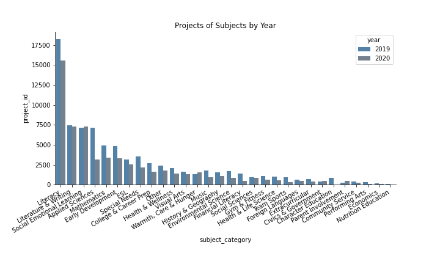
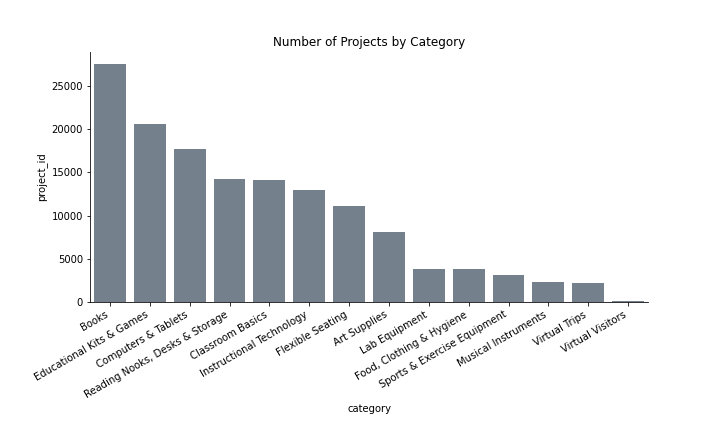

## 2019 and 2020 crowdfunding essays

### category
'Arts': 'Art Supplies', 'Musical Instruments'

'Supplies': 'Supplies','Books', 'Lab Equipment','Classroom Basics', 'Awaiting Classification','Reading Nooks, Desks & Storage','Flexible Seating','Food, Clothing & Hygiene','Other'

'Tech': 'Technology','Computers & Tablets','Instructional Technology'

'Entertainment': 'Sports & Exercise Equipment','Educational Kits & Games'

'Visits': 'Virtual Trips','Virtual Visitors'

### subject_category
'Science': 'Applied Sciences','Environmental Science','Mathematics','Health & Life Science'

'Language': 'Financial Literacy','Literacy','Literature & Writing','Foreign Languages','ESL'

'Social Sciences': 'History & Geography','Social Sciences', 'Economics', 'Civics & Government'

'Health and Sports': 'Health & Wellness', 'Nutrition Education','Special Needs','Gym & Fitness','Team Sports'

'Arts': 'Visual Arts','Music','Performing Arts'

'Extracurricular': 'Parent Involvement', 'Extracurricular','Community Service','Warmth, Care & Hunger','Character Education','Early Development','College & Career Prep','Social Emotional Learning','Other'

### grade_level
"Grades PreK-2","Grades 3-5","Grades 6-8","Grades 9-12"

### Subject and Category

## Structured
`lp ~ 1 + school_state + C(year) + C(month)`

lp - log price

`lp ~ 1 + CATEGORY + SUBJECT + grade_level + school_percentage_free_and_reduced_price_lunch_eligible + C(year) + C(month)`

`lp ~ 1 + pca1 + pca2 + pca3 + pca4 + pca5 + pca6 + neg + pos`

where PCAs are first six components of the extracted textfeatures; neg and pos are proportion of positive and negative words

`lp ~ 1 + CATEGORY + SUBJECT + grade_level + school_percentage_free_and_reduced_price_lunch_eligible + n_words + n_polite + ari + sent_vader + C(year) + C(month)`
n_polite - number of polite words

ari - Automated Readability Index (ARI)

sent_vader - vader sentiment

`label ~ 1 + CATEGORY + SUBJECT + grade_level + n_words + n_polite + ari + sent_vader`

label - 1 (high poverty), 0 (low poverty)

`label ~ 1 + pca1 + pca2 + pca3 + pca4 + pca5 + pca6 + neg + pos`

## Unstructured
### Poverty Level
`Test Loss: 0.508 | Test Acc: 75.02%`

Rich

['school\u200b', 'flipgrid', 'sharpers', 'windowless', 'slinkies', '2020/2021', 'playdoh', 'gineers', 'headset', 'duct', 'that-', '-on', 'eight-', 'year-', 'squishies', 'reteaching', '\u200band', 'splitter', 'la', 'para', 'gon', 'mindedness', 'alouds', 'throwable', 'zippered', 'crate', 'engross', 'porch', 'on\u200b', 'departmentalized', 'clicks', 'scanned', 'students-', 'robotic', 'algebraic', 'bead', 'pincer', 'pains', 'chord', 'freshman', 'configured', 'boundless', 'folder', 'audiobooks', 'pouch', 'bookshelf', 'w', 'lockers', 'starter', 'thermochemistry', 'rectangular', 'powers', 'weekday', 'violin', 'seating', 'divider', 'dimensional', 'court', 'covid-19', 'coat', 'browsing', 'adapter', 'progressions', 'infinite', 'chargers', 'cartridge', 'rechargeable', 'awe', 'twelfth', 'percentile', 'flight', 'potting', 'upload', 'i3', 'surf', 'simulators', 'covid', 'vessel', 'is\u200b', 'refills', '=', 'quests', 'twistable', 'debug', 'fantasy', 'energize', 'paddles', '8th', 'drone', 'fluorescent', 'scanning', 'corona', 'bookcases', 'sequel', 'clarinets', 'ebooks', 'repetitive', 'align', 'division', 'kinders']

Poor

['individualities', 'benefits', 'textured', 'epidemic', 'kidney', '1000x', 'prevention', 'neighborhoods', 'incomes', 'surveyed', 'disability', 'supplemental', 'soar', 'average', 'urban', 'severe', 'rate', 'chip', 'migrant', 'breakfast', 'market', 'poorest', 'worst', '10-year', 'rising', 'low', 'adoptions', 'demographic', 'cash', 'poor', 'populations', 'rural', 'reap', '2nd-5th', 'illiterate', 'unproductive', 'inequality', 'decrease', 'impoverished', 'living', 'fourths', 'pandemic', 'families', 'possible-', 'affluent', 'net', 'heating', 'welfare', 'fund', 'households', 'laminator', 'bilingualism', 'kinesthetically', 'dollars', 'booming', 'percent', 'existent', 'disadvantaged', '1.9', 'electricity', 'socioeconomic', 'hotels', 'expenses', 'osmos', 'suffering', 'allotment', 'harvest', '%', 'burden', 'iready', 'tuition', 'underprivileged', 'deficit', 'disease', 'monsoon', 'borrowing', 'hyperactivity', 'someday\u200b', '65', 'productivity', 'savings', 'learnings', '1.5', 'consumption', 'cereal', 'chocolate', 'low‑income', 'outbreak', 'boroughs', 'exceeding', 'poverty', 'alleviate', 'cheese', 'income', 'burdened', '$', 'village', 'nt', 'employment', 'million']

### Covid19

`Test Loss: 0.547 | Test Acc: 75.88%`

2019

['powerpoints', '200-hour', 'kinesthetically', 'protractors', 'that-', 'qr', 'income\u200b', 'keychains', 'chord', 'harmonies', 'manifold', 'overlapping', 'alouds', 'metallophones', 'modal', 'playdough', 'aquarium', 'world\u200b', 'scavenger', 'repertoire', 'orbit', 'multimodal', 'touchscreen', 'students-', 'hyperdocs', 'working\u200b', 'rectangular', 'bookcase', 'smartboard', 'weave', 'movable', 'lifecycle', 'progressions', '504s', 'decimal', 'temperature', 'classroom-', 'boo', 'stringed', '1000x', 'inclusiveness', 'seating', 'selfie', 'curved', 'auditorium', 'hunts', 'cohesive', 'slime', 'configured', 'zipper', 'melodies', 'on\u200b', 'zippered', 'florescent', 'thematic', '3d', 'fist', 'hands-', '\u200band', 'teaser', 'wasn', 'iready', 'coughing', 'makerspace', 'hoop', 'sneakers', 'rays', 'efficacy', 'fictional', 'saucer', 'modular', 'freshly', 'blacktop', 'laminate', 'counters', 'pale', 'weighted', 'nonfiction', 'writings', 'interface', 'courtyard', 'cage', 'downloaded', 'customizable', 'extracurricular', 'sunglasses', 'philosophy', 'sketches', 'nationalities', 'circular', 'confines', 'loveable', 'poems', 'purifier', 'foldable', 'ensembles', 'productively', 'percentile', 'bracelets', 'assemblies']

2020

['wealth', 'preforming', 'metro', 'dose', 'rates', 'productivity', 'region', 'affected', 'breakfast', 'lodging', 'deficit', '85', 'dollar', 'exposure', 'camps', 'beacon', 'village', 'plentiful', 'households', 'homelessness', 'sustenance', 'weak', '6-', 'counties', '49', 'burden', 'rate', 'handouts', 'seizures', 'spread', 'stricken', 'reduction', 'lexia', 'reminder', 'instability', 'loan', 'racially', 'hardships', 'qualifies', 'pizza', 'alleviate', 'flood', 'infectious', 'blankets', 'rural', 'lagging', 'endured', 'shortage', 'low', 'refugee', 'survivors', 'upkeep', 'expend', 'socio', 'tuition', 'reliant', 'reunite', '®', 'prices', 'stigma', 'chronic', 'percent', 'diminish', 'urban', 'life\u200b', 'city\u200b', 'injustices', 'estimate', 'inequality', 'faraway', '%', 'socioeconomic', 'freezing', 'fears', 'exceptionalities', 'disadvantaged', '$', 'pandemic', 'influx', 'rising', 'exceed', 'low‑income', 'day\u200b', 'illiteracy', 'expenses', 'income', 'rains', 'flooding', 'poorest', 'impoverished', 'eight-', 'poverty', 'slinkies', 'pollution', 'possible-', 'playdoh', 'gineers', 'commute', 'candling', 'burdened']

When delete "covid","covid19","covid-19","Covid","COVID","Covid-19","COVID19","COVID-19"

`Test Loss: 0.700 | Test Acc: 50.69%`

2019

['\u200band', 'slabbed', 'all-', 'need\u200b', 'grateful-', 'index', 'selfie', '\u200b', 'screencast', 'grade\u200b', 'dabbers', 'classdojo', 'throwable', 'kidshardworking', 'aloud\u200b', 'wonderings', 'de', 'ally', 'departmentalize', 'elearn', 'peacefully', 'notetaking', 'v', 'godsend', 'nationalities', 'bellies', 'degrees', 'bedroom', 'container', 'drug', 'futures', 'bees', 'diapers', 'clicking', 'intentional', 'motors', 'tac', 'grips', 'armrest', 'unplug', 'powerpoints', '-the', 'waving', 'endurance', 'fixing', '°', 'intonation', 'punch', 'pot', 'measures', 'exponentially', 'properties', 'eraser', 'hurdle', 'streaming', 'stake', 'exceptionalities', 'wasting', 'cozier', 'giant', 'fought', 'zest', 'approval', 'cups', 'waking', 'encompasses', 'absorption', 'misplaced', 'stressors', 'delicious', 'mighty', 'chewing', 'plastics', 'printables', 'transport', 'reliant', 'teachable', 'drastic', 'marine', 'removed', 'below', 'stakes', 'combat', 'stitching', 'hep', 'browse', 'flora', 'worms', 'hole', 'sweeper', 'intense', 'conjunctions', 'understandings', 'bay', 'donorschoose.org', 'seamlessly', 'goggle', 'lap', 'sweaty', 'hasn']

2020

['program-', 'bookcase', 'suitable', 'frustrate', 'turtle', 'rockets', 'brightly', 'equivalency', 'forests', 'baccalaureate', 'nearest', 'reteaching', 'twistable', 'betterment', 'graciously', 'heritages', 'frogs', 'depression', 'advertisements', 'decline', 'fragments', 'trees', 'helper', 'bear', 'highlighted', 'refreshed', 'earthquake', 'centrifuge', 'forest', 'furthering', '..', 'habitats', 'progresses', 'sheltering', 'smell', 'reclassified', 'unreal', 'sketchbooks', 'minis', 'bin', 'bowl', 'experimental', 'proximity', 'diversify', 'dinosaur', 'synchronously', 'pillars', 'castle', 'facilitators', 'wealthier', 'cars', 'expedition', 'advertising', 'littlest', 'curate', 'conjecture', 'asap', 'streams', 'emotional\u200b', 'insatiable', 'firsties', 'procedures', 'lamination', 'replenishes', 'spruce', 'spirits', 'graphs', 'viruses', 'communal', 'religions', 'brick', 'lake', 'relations', '27th', 'ancestry', 'steadfast', 'low-', 'masters', 'certified', 'gardens', 'to\u200b', 'impairment', 'console', 'trails', '12:1:1', 'ranching', 'marjority', 'income\u200b', 'iseeme', 'free\u200b', 'hokki', 'giftedness', 'unifix', 'kinesthetically', 'manuscript', 'pre-', 'kinders', 'bandaids', 'life\u200b', 'hands-']

### Subsample Data - Category

Entertainment (ent)

`Test Loss: 0.569 | Test Acc: 72.49%`

Rich

['equivalency', 'commodities', '3rd', 'compliment', 'scripts', 'scribe', 'jigsaw', 'cubby', 'slap', 'thrives', 'asks', '2nd', 'tray', 'launcher', 'graphics', 'integrates', 'raining', 'string', 'adventure', 'beginner', '8th', 'sequencing', 'delivery', 'dominoes', 'cube', 'computational', 'imitation', 'expressively', 'wouldn', 'programmable', 'bookshelf', 'square', 'editing', 'fabric', '5th', 'winner', 'swivel', 'graphs', 'chunks', 'programmer', 'connectors', 'authentically', 'drawstring', 'investigative', 'ah', 'epic', 'analog', 'fits', 'tile', 'three‑quarters', 'symbolic', 'classical', 'bundles', 'reads', '7th', '6th', 'figurative', 'sequence', '4th', 'threw', 'scented', 'smartphone', '\u200band', 'washable', 'poems', 'weighted', 'storybook', 'gel', 'activating', 'bracelets', 'conductivity', 'canopy', 'reteach', 'personalize', 'compound', 'playdough', 'vests', 'cvc', 'students\u200b', 'sectional', 'kindergarten-5th', 'lemonade', 'knit', 'algebra', 'whiteboard', 'cereal', 'orally', 'inventor', 'chromebooks', 'receptively', 'script', 'lightweight', '-19', 'nook', 'students-', 'pinnies', 'ozobots', 'smartboard', 'alouds', '®']

Poor

['incomes', 'are\u200b', 'deficits', 'on\u200b', '3-', '2019/2020', 'kickballs', 'income', 'geoboard', 'uninterrupted', 'productivity', 'poverty', '%', 'northeast', 'makerspace', 'kinders', 'percentage', '123s', 'revenue', '2nd-5th', 'hourly', 'sanitation', 'lending', 'poorest', 'hunts', 'neediest', 'dependent', 'degrees', 'tissue', 'equality', 'cubelets', 'farming', 'accommodations', '$', 'township', 'outbreak', 'rate', 'refugee', 'rates', 'equity', 'honoring', '225', 'educates', 'perks', 'muscular', 'enrollment', 'underfunded', '..', 'disadvantaged', 'losses', 'socioeconomic', 'supporters', 'archaeologists', '90', 'low', 'population', 'households', 'percent', 'impoverished', 'castle', 'racial', 'erosion', '=', 'diagnosed', 'depleted', 'ons', 'palsy', 'hugged', 'elephant', 'explorative', 'cuties', 'spinner', 'camps', '86', '45', 'benefits', 'aids', 'lowincome', '12:1:1', 'families', 'uplift', 'hurricanes', '7-year', 'sparked', 'neighboring', 'kindergartens', 'rover', 'storms', 'steady', 'fund', 'withdrawals', 'dino', 'contributes', 'undergone', 'olds\u200b', 'bin', 'dry', 'continual', 'scavenger', 'dose']

Tech (tech)

`Test Loss: 0.499 | Test Acc: 76.58%`

Rich

['hardwiring', 'wonderings', 'musix', 'reusable', 'exceptionalities', 'important\u200b', 'screencast', 'convergent', 'dice', 'tangrams', 'reteaching', 'flipgrid', 'dialects', 'moveable', 'laminator', 'recorder', 'formatting', 'highlighters', 'ozobot', 'disseminated', 'abstract', 'asynchronous', 'unity', 'donorschoose.org', 'acrylic', 'percentile', 'genres', 'blank', 'starfall', 'videography', 'covid', 'decimals', 'synchronous', 'selphy', 'cookie', '-5th', 'smartboard', 'neon', 'five-', 'bluetooth', 'aligns', 'modalities', 'showcasing', 'protocols', 'wouldn', 'mics', 'algebra', 'subsystems', '-we', 'reset', 'makey', 'syllable', '.and', 'textures', 'seed', 'decodable', 'amplifier', 'ukulele', 'biomes', '9th-12th', 'docking', 'discrete', 'phonics', 'outs', 'diagram', 'gold', 'reflex', '2018', 'carries', 'console', 'motion', 'laser', 'rock', 'graph', 'grammatical', 'instills', 'divergent', 'arm', 'sharpener', 'inventions', 'formats', 'eventual', 'bells', 'sized', 'chord', 'laminating', 'twentieth', 'peaceful', 'playlists', 'visions', 'webquests', 'paced', 'unison', 'beginner', 'rendering', '1:1', '90th', 'whiteboard', 'lens', 'trial']

Poor

['populations', 'dependent', 'encountered', 'vulnerable', 'sore', 'survey', 'cups', 'ozobots', 'unnecessary', 'remainder', 'visited', 'percentage', 'reopen', 'depths', 'rates', 'monthly', '2020', 'price', 'housing', 'fears', 'touchpad', 'inquiries', 'drops', 'mild', 'promotion', 'projected', 'region', 'torn', '75', 'student-', 'classdojo', 'amidst', 'tons', 'suffered', 'uncomfortable', 'economic', 'portability', 'poor', 'homeless', 'mile', 'regroup', 'socialize', 'attainment', 'decrease', 'lower', 'burden', 'coronavirus', 'contagious', 'farming', 'threat', 'rural', 'fallen', 'restaurant', 'socioeconomic', 'north', 'households', 'low', 'wildlife', 'pockets', 'property', 'deficits', 'subsidized', 'rampant', 'incomes', 'insufficient', 'salary', 'infection', 'businesses', 'minimum', 'coats', 'sleeve', 'tuition', 'selfie', 'expenses', 'risen', 'firsties', 'lowest', 'average', 'dramatically', '84', 'pandemic', 'poverty', 'poorest', 'disadvantaged', '%', 'net', 'scarcity', 'quarantine', 'smoother', 'wealthier', 'refugees', 'income', 'nt', 'impoverished', 'neurotypical', 'ticket', 'underserved', '1.5', 'earnings', 'reteach']

Supplies (sup)

`Test Loss: 0.516 | Test Acc: 74.87%`

Rich

['2020/2021', 'working\u200b', '-and', 'well-', 'wonderings', 'four-', 'departmentalized', 'students-', '3-', 'programable', 'interdisciplinary', 'alouds', 'on\u200b', 'fundations', 'fluently', 'learning-', 'reteaching', 'interconnected', 'rigid', 'playdough', 'toe', 'tummies', 'them\u200b', 'empathetic', 'diagrams', 'toolkit', 'book-', 'graphs', 'mystery', 'dazzling', 'revising', 'viewers', 'teachable', 'ecomonic', 'laminate', 'dystopian', 'beginner', 'revise', 'lamination', 'external', '6th-8th', 'framework', 'pom', 'bonus', 'appreciative', 'mechanism', 'watercolor', 'littles', 'achievable', 'tone', 'quest', 'renovated', 'cursive', 'mature', 'afterschool', 'natures', 'drawers', 'sciences', 'sincere', 'seamlessly', 'removable', 'quizzes', 'captivating', 'seating', 'dolls', 'internship', 'expo', 'drawer', 'pictorial', 'enjoyable', 'changer', 'cherish', 'beautify', 'facilitator', 'deepen', 'illustrator', 'venture', 'journaling', 'constructive', 'geometric', 'strengthens', 'redesign', 'alphabet', 'rows', 'aide', 'adaptable', 'graph', 'curved', 'goofy', 'philosophy', 'redecorate', 'multiplication', 'joins', 'document', 'yay', 'disengaged', 'researched', 'bookshelf', 'cohesive', 'storytelling']

Poor

['soaking', 'rising', 'urban', '63', 'capital', 'profit', 'county', 'crops', 'reaches', 'price', 'tops', 'stakes', 'southeastern', 'lunch', 'erasable', 'lake', 'heavy', 'fallen', 'merchant', 'byes', 'groceries', 'temperature', 'syndrome', 'ton', 'rural', 'trapped', 'economic', 'grade\u200b', 'virus', 'vegetables', 'funds', 'foods', 'rescue', 'low', '94', 'mile', 'slid', 'waste', 'socioeconomic', 'achievers', 'diseases', 'male', 'kinders', 'aids', 'b', 'suburbs', 'bandits', 'alleviate', '..', 'aren', 'socio', 'percent', 'isolation', 'ranching', 'neglect', 'meat', 'fell', 'adjusted', 'homelessness', 'percentage', 'discount', 'uncomfortably', 'beds', 'wouldn', 'pollution', 'harsh', 'lion', 'lower', '1/3', 'cord', 'populations', 'underprivileged', 'wealth', 'corona', 'makerspace', 'suffering', 'quarantined', 'symptoms', 'accumulated', '%', '2/3', 'unproductive', 'crumbling', 'violent', 'insecurity', 'rainy', 'foothills', 'self-', 'epidemic', 'income\u200b', 'desert', 'income', 'poverty', 'paycheck', 'cohort', 'day\u200b', 'incomes', 'incidence', 'deficit', 'notetaking']

Visits (vis)

`Test Loss: 0.313 | Test Acc: 86.46%`

Rich

['gineers', 'students-', '\u200b', '\u200band', 'unifix', 'arsenal', '®', 'olds\u200b', 'bulb', 'that-', 'hyperactivity', 'curve', 'amazes', 'unstructured', '5-', 'division', 'kinders', 'augmentative', 'goggles', 'generational', 've', 'chromebooks', 'electives', 'nook', 'rotated', 'pipe', 'putty', 'proprioceptive', 'curricular', 'multiplication', 'stimulation', 'r', 'mechanical', 'cohesive', 'civilizations', 'tennis', 'matches', 'dirt', 'anti', 'assists', 'blast', 'holes', 'suburb', 'questioning', 'tac', 'flower', 'oh', 'folds', 'percentile', 'spheres', 'collections', 'glitter', 'amazement', 'bustling', 'slides', 'docs', 'cardio', 'rejoin', 'scaffold', 'cvc', 'fluorescent', 'recesses', 'comfy', 'cubes', 'homey', 'stressful', 'endings', 'volcano', 'tub', 'zest', 'her', '1:1', 'crash', 'littles', 'intriguing', 'decimal', 'dinosaur', 'appreciative', 'bubbles', 'cones', 'indoor', 'goodies', 'geometry', 'explosion', 'uncertainties', 'ethnically', 'brick', 'fridge', 'de', 'disorders', 'triumphant', '-', 'unpack', 'boundless', 'rug', 'magnifying', 'algebra', 'adaptable', 'smell', 'pretty']

Poor

['2021', 'disabled', 'sandwiches', 'attempt', 'tangram', 'restrictive', 'windows', 'incentives', 'forest', 'female', 'county', 'contains', 'articles', 'documents', 'qualify', 'quarantine', 'immensely', 'labels', 'accommodations', 'languages', 'coincide', 'tablets', 'certified', 'member', 'majority', 'don', 'poor', 'clicking', 'guidelines', 'president', 'curriculums', 'widely', 'permission', 'writers', 'noodles', 'certificate', 'inventors', 'negative', 'creators', '700', 'python', '+', 'washed', 'lifted', '2.0', 'significantly', 'containers', 'link', 'familiarize', 'nt', 'strengthens', 'economically', 'citizen', 'supplied', 'entice', 'virus', 'socio', 'educator', 'passages', 'thriving', 'framework', 'caddies', 'guarantee', 'population', 'households', 'refugees', 'alleviate', 'lightweight', 'apartments', 'coordinate', 'specials', 'geoboard', 'authors', 'ignite', 'canceled', 'prime', 'storybook', 'meals', 'retell', 'global', 'mainstream', 'ticket', 'income', 'decorate', 'rekenreks', 'uppercase', 'credit', '%', 'rocket', 'commute', 'coronavirus', 'pandemic', 'priced', 'folder', 'magnatiles', 'hyperdocs', 'playdough', 'lowercase', 'alouds', 'covid']

Arts(art)

### Subsample Data - Subject

